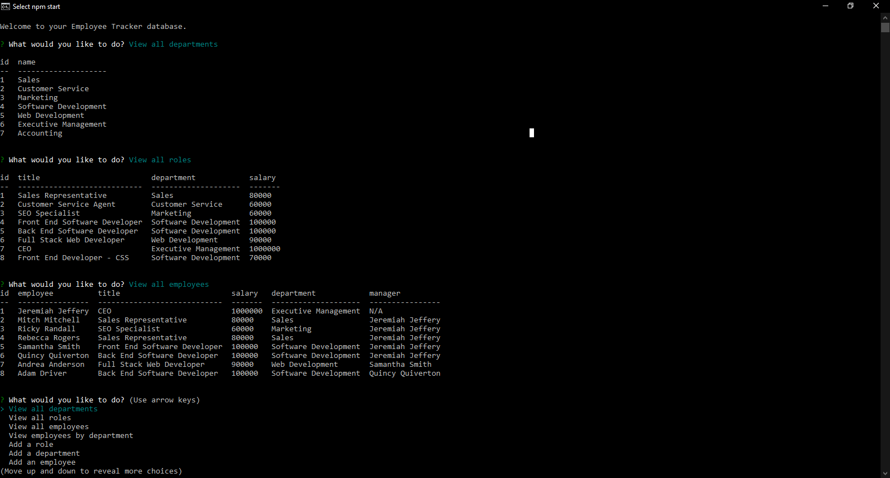

# employee-tracker

## Table of Contents
* [Description](#Description)
* [Installation](#Installation)
* [Usage](#Usage)
* [Questions](#Questions)
* [Credits](#Credits)

## Description
E-T is an application designed to help clients manage a database of employees and managers. The languages and technologies used to build this application are JavaScript, ES6, Node.js, Inquirer, MySQL, & Console.Table. 

## Usage
Here is a video demonstration of how to use this app:

## Installation
To use this application the user will need to clone this repository to their machine.

## Questions
If you have any questions about this project, please contact me via my GitHub: https://github.com/garretthilberling

## Credits
This project was created solely by Garrett Hilberling: https://www.linkedin.com/in/garretthilberling/
    
